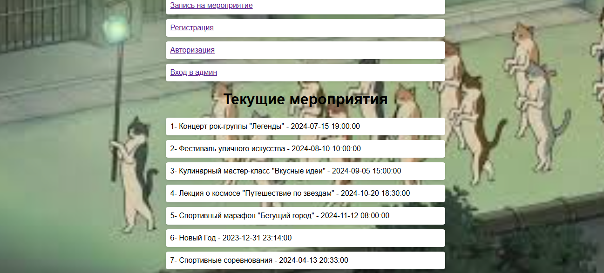

# Проект "Управление мероприятиями"

## 1. Инструкции по запуску проекта
- Скачайте все файлы проекта и разместите их в каталоге вашего веб-сервера.
- Убедитесь, что на вашем компьютере установлен и настроен веб-сервер, база данных MySQL и PHP.
- Импортируйте предоставленный SQL-файл для создания базы данных и таблиц.
- Запустите веб-сервер и откройте файл `index.php` в веб-браузере.

## 2. Описание лабораторной работы
Лабораторная работа по созданию веб-приложения для управления мероприятиями включает в себя следующие этапы:
- Создание базы данных для хранения информации о мероприятиях и пользователях.
- Настройка веб-приложения для регистрации и аутентификации пользователей.
- Реализация возможности просмотра текущих мероприятий, записи на мероприятие и администрирования мероприятий.

## 3. Документация к проекту
### Содержание
- Веб-приложение для управления мероприятиями.
### Функциональные возможности
- Регистрация и аутентификация пользователей.
- Просмотр текущих мероприятий.
- Запись на мероприятие.
- Администрирование мероприятий: добавление, редактирование.
### Сценарии взаимодействия пользователей с веб-приложением
1. Пользователь регистрируется, заполняя форму с именем, фамилией и адресом электронной почты.
2. Пользователь авторизуется, вводя свой адрес электронной почты.
3. Пользователь просматривает список текущих мероприятий.
4. Пользователь выбирает мероприятие и записывается на него, указывая свои данные.
5. Администратор входит в административную панель, где может добавлять, редактировать мероприятия.
### Структура БД
- Таблица `users`: id, name, surname, email, role_id.
- Таблица `events`: id, name, price, number_seats, date.
- Таблица `event_records`: id, user_id, event_id.
- Таблица `roles`: id, name.

## 4. Примеры использования проекта
- Регистрация пользователя:
  
- Просмотр текущих мероприятий:
  
- Административная панель:
  

